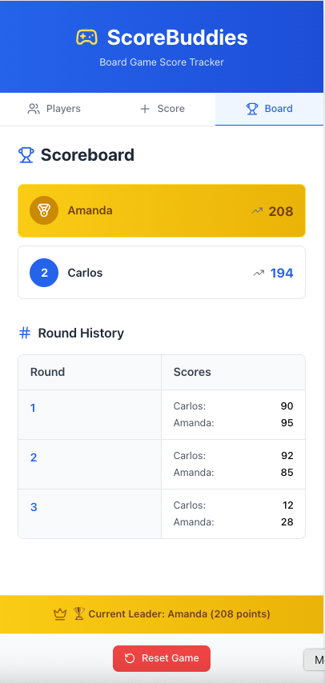

# 🎮 ScoreBuddies

**ScoreBuddies** is a lightweight and responsive React app designed to help you track scores with friends during game nights. Whether you're playing card games, board games, or party games — ScoreBuddies makes it fun and simple to keep track of every round, every player, and every point.



---

## 🚀 Features

- ✅ Add and manage players
- 🧮 Input and track scores by round
- 🧠 Auto-calculated scoreboard
- 🏆 Display of winner with a banner
- 🎨 Responsive and mobile-friendly UI
- 🔁 Tab-based navigation for easy flow

---

## 🛠️ Tech Stack

- **React** with functional components and hooks
- **TypeScript** (if applicable)
- **Tailwind CSS** for styling
- **Context API** for game state management

---

## 🧱 Project Structure

```
src/
├── components/       # UI components like Header, Footer, ScoreInput...
├── hooks/            # Custom hook (useGame) + context provider
├── App.tsx           # Main app logic
├── index.tsx         # React root
public/
├── favicon.svg       # Custom Lucide icon as favicon
├── index.html        # Cleaned-up HTML template
```

---

## 🧑‍💻 Getting Started

### 1. Clone the Repository
```bash
git clone https://github.com/caduff97/scorebuddies.git
```

### 2. Install Dependencies
```bash
npm install
```

### 3. Start the Development Server
```bash
npm start
```

### 4. Build for Production
```bash
npm run build
```

---

## ⚙️ Customization

Want to add game rules, score modifiers, or export features?
Feel free to fork this project or open a PR!

---

## 📦 Deployment

You can easily deploy this app to:

- **Vercel**
- **Netlify**
- **GitHub Pages**
- or any static hosting platform that supports `create-react-app`

---

## 🧠 TODO / Improvements

- [ ] Add dark mode
- [ ] Save game state to database
- [ ] Export scores as CSV or PDF
- [ ] Add animations or confetti on win
- [ ] Shareable scoreboard link

---

## 🤝 Contributing

Contributions are welcome! Feel free to submit issues, suggestions, or pull requests.

---

## 📄 License

MIT License © 2025 [Carlos Fernandes]

---

## 💡 Inspiration

Built to make game nights smoother, ScoreBuddies was created to help friends focus on fun — not math. ✌️